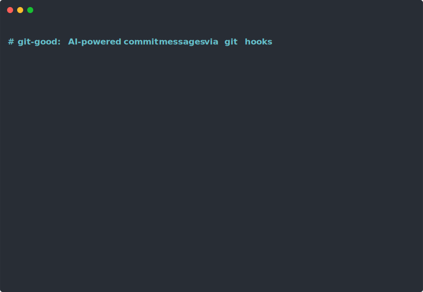

# git-good

AI-powered commit message generation via git hooks. Write `@@ai@@` as your commit message and let Claude fill it in.

## Demo

[](./demo.svg)

## How it works

1. Install the git hook into your repo
2. When you commit, use `@@ai@@` as your message (or part of it)
3. The hook sends your staged diff to Claude and replaces the placeholder with a generated commit message

## Installation

```bash
# Install the package
uv pip install git-good

# In your git repo, install the hook
git-good install

# Or install globally for all repos
git-good install --global
```

## Usage

```bash
# Stage your changes
git add -A

# Commit with the placeholder — Claude writes the message
git commit -m "@@ai@@"

# Or use the commit template (set up by git-good install)
git commit
# -> editor opens pre-filled with @@ai@@, replaced on save

# You can also use it as part of a message
git commit -m "@@ai@@

Co-authored-by: Me <me@example.com>"
```

## Requirements

- Python >= 3.14
- [Claude Code](https://docs.anthropic.com/en/docs/claude-code) CLI installed and authenticated

## Development

```bash
git clone https://github.com/bpayne/git-good.git
cd git-good
uv sync

# Run tests
uv run pytest tests/ -v

# Re-record the demo
uv run python scripts/record_demo.py
```

## License

MIT
